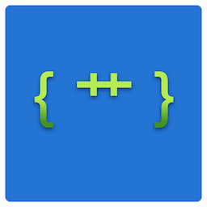
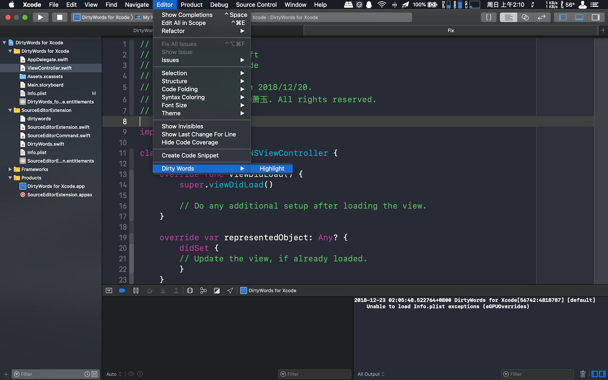
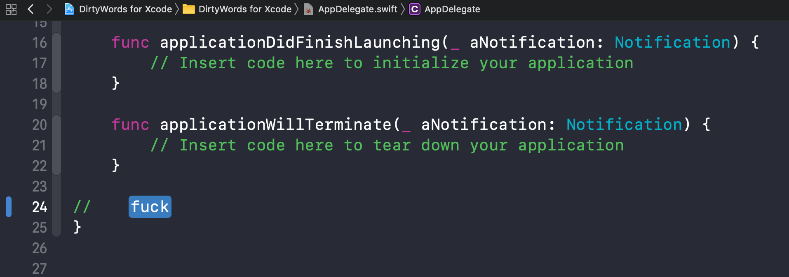
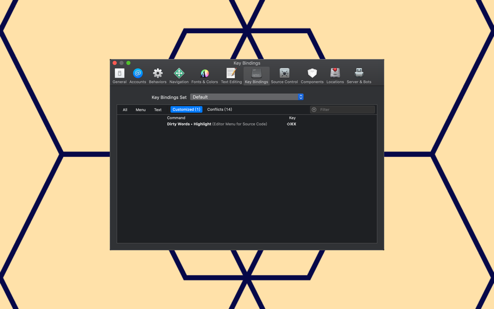

# DirtyWords-for-Xcode

## Usage

Highlight dirty words in Xcode.

Dirty words will be highlighted. You can replace these with better words.

Important: If there’s nothing in the Editor menu, open System Preferences -> Extensions and put a checkmark next to “DirtyWords for Xcode”.

Like any other editor command, you can assign a keys combination to yours. Go to Xcode > Preferences > Key Bindings > search for “Dirty Words”.

## Dirty Words List

All dirty words are listed in [dirtywords](https://github.com/yulingtianxia/DirtyWords-for-Xcode/blob/master/SourceEditorExtension/dirtywords) file. You can add new dirty word to it. PR is welcome.

"DirtyWords for Xcode" would load [dirtywords](https://github.com/yulingtianxia/DirtyWords-for-Xcode/blob/master/SourceEditorExtension/dirtywords) file when the extension did finish launching.
