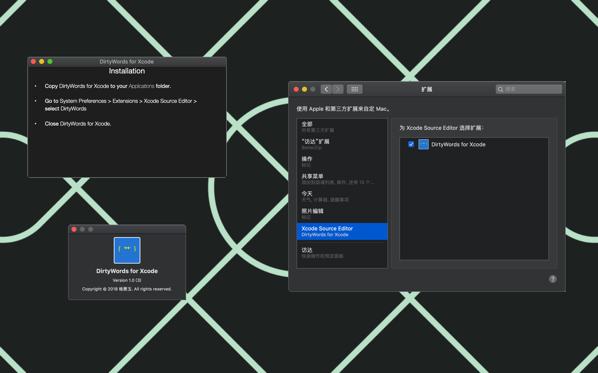

# DirtyWords-for-Xcode

Highlight dirty words in Xcode.

Important: If there’s nothing in the Editor menu, open System Preferences -> Extensions and put a checkmark next to “DirtyWords for Xcode”.

Dirty words will be highlighted. You can replace these with better words.

Like any other editor command, you can assign a keys combination to yours. Go to Xcode > Preferences > Key Bindings > search for “DirtyWords”.

